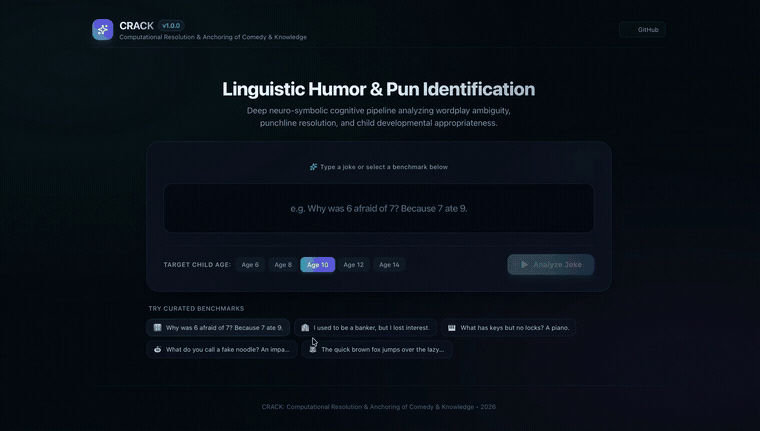
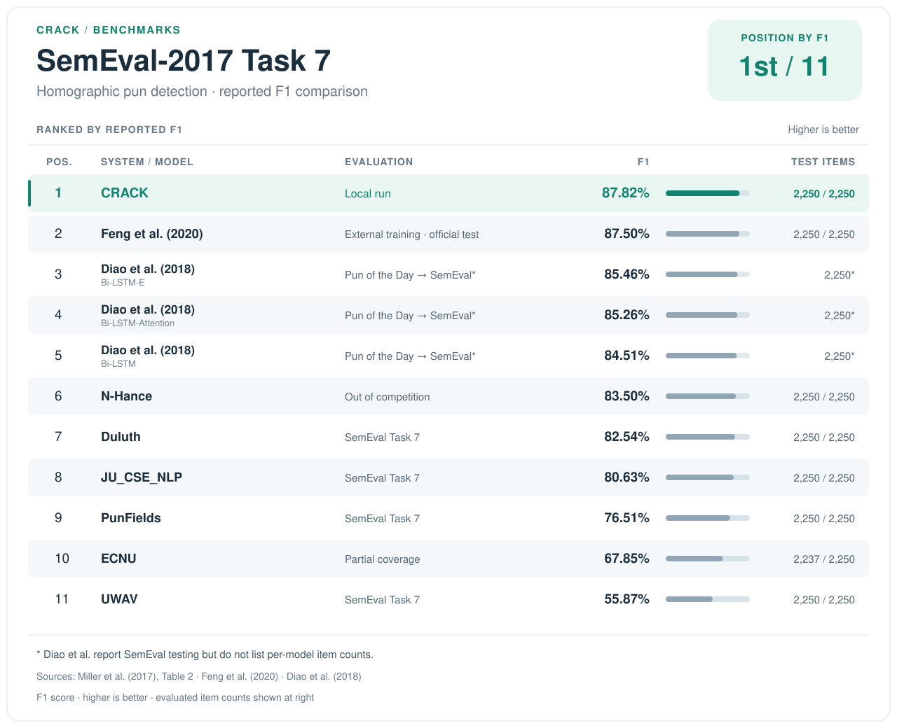
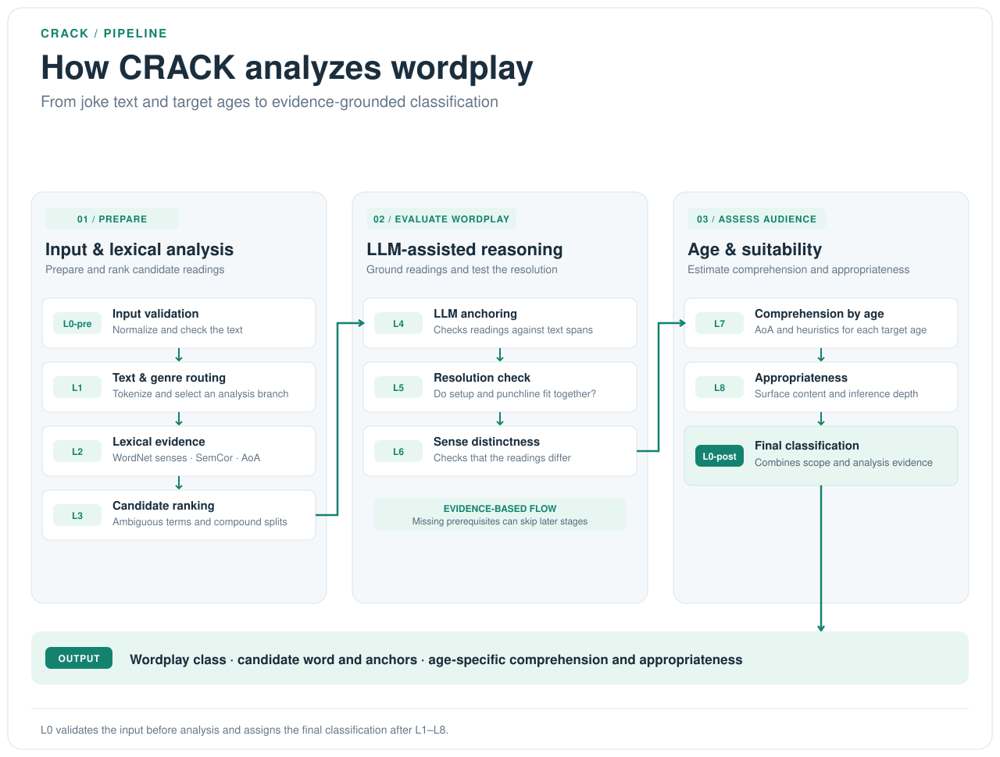

# CRACK

[](https://github.com/Jyz922/Crack/releases/tag/v1.0.0)
[](https://www.python.org/downloads/)
[](LICENSE)

**CRACK** (Computational Resolution & Anchoring of Comedy & Knowledge) analyzes English wordplay by combining WordNet, SemCor, age-of-acquisition data, and configurable LLM judgments. It identifies candidate ambiguous words, records text spans supporting each reading, assesses joke resolution, and reports comprehension and appropriateness by requested age.

The pipeline targets homographic wordplay (one spelling with multiple meanings) and compound resegmentation. Contextual analysis can use any of the supported LLM providers.

### Try CRACK live

Curious how it works? [Try the live demo](https://crack-8s9j.onrender.com): enter an English joke and watch CRACK analyze its possible wordplay, meaning, and age-level comprehension.

<p align="center">
  
</p>

## Evaluation data and reported results

### SemEval-2017 Task 7

The repository includes the homographic test split: 2,250 items, comprising 1,607 annotated puns and 643 non-puns. The conversion script downloads the official task archive and creates separate blind-input and gold-label files. See the [task paper](https://aclanthology.org/S17-2005/) and the [official results and data page](https://alt.qcri.org/semeval2017/task7/index.php?id=results).

On the full 2,250-item homographic test split, CRACK's reference run achieved **82.84% accuracy** and **87.82% F1**, with 89.11% precision and 86.56% recall. It correctly detected 1,391 of 1,607 puns and rejected 473 of 643 non-puns.

CRACK combines WordNet and SemCor lexical evidence with LLM-assisted checks of candidate readings, textual support, and joke resolution. The [pipeline overview](#how-the-pipeline-works) shows how these stages lead to the final classification. The data preparation and evaluation command below let readers run the same benchmark split with their own provider configuration.

The metrics below summarize the reference run:

| Metric | Reported value | Count |
|---|---:|---:|
| Accuracy | 82.84% | 1,864 / 2,250 |
| Precision | 89.11% | 1,391 / 1,561 predicted puns |
| Recall | 86.56% | 1,391 / 1,607 annotated puns |
| F1 | 87.82% | Derived from the precision and recall above |
| Correctly rejected non-puns (`ONE_SENSE_ONLY`) | 73.56% | 473 / 643 |

Use the reproduction command below to run inference and scoring on this same official split with your chosen provider configuration.

The comparison below covers binary homographic-pun detection; pun-sense interpretation scores measure a different task.

### SemEval-2017 Task 7 detection comparison

Ranked by reported F1, the table includes the task-paper systems and later SemEval evaluations. It focuses on full-set results; Fermi's 675-item partial-set result is not included. CRACK ranks **1st of 11 results**.



**Sources and settings:** Original task results are from [Miller et al. (2017), Table 2](https://aclanthology.org/S17-2005.pdf). N-Hance was out of competition, and ECNU reported 2,237 items. Feng et al.'s second setting trains on self-collected data; Diao et al. train on Pun of the Day and test on SemEval. The linked papers describe each evaluation setup.

### Other reported results

[Diao et al. (2018), Table 3](https://aclanthology.org/D18-1272.pdf) reports these additional scores:

| Model | Paper-reported F1 |
|---|---:|
| WECA | 89.21%* |
| LSTM | 82.43%* |

The values above are quoted from Table 3. The paper reports different WECA figures in its discussion; Table 4 evaluates WECA on a 675-item subset.

Other evaluation settings report Zhou et al. (2020) at 94.9% and Zou & Lu (2019) at 92.2% using 10-fold cross-validation, and Feng et al.'s first setting at 93.0% using 5-fold cross-validation. These results use cross-validation protocols; see [Feng et al. (2020), Table 1 and notes](https://ceur-ws.org/Vol-2624/paper3.pdf).

### Project-curated corpus

The project-curated corpus contains 60 items: 25 wordplay examples and 35 `ONE_SENSE_ONLY` controls (25 de-joked examples and 10 ordinary statements). The gold file also includes genre, target-word, sense, and age-comprehension annotations. See the [annotation guidelines](corpus/annotation_guidelines.md) for the dataset structure and labels.

A full run on the current corpus (OpenAI, `gpt-6-luna`; September 30, 2026) achieved **93.33% exact-label accuracy** (56/60). For binary pun detection, the two `VALID_*_JOKE` labels count as positive and all other outputs as negative: precision **89.29%**, recall **100.00%**, and F1 **94.34%**. Age-comprehension outputs matched 142/180 project annotations (78.89%). All 60 predictions match the current input texts, and no pipeline stage reported an error.

| Gold / predicted | `ONE_SENSE_ONLY` | `VALID_HOMOGRAPH_JOKE` | `VALID_COMPOUND_SPLIT_JOKE` | `RESOLUTION_FAIL` |
|---|---:|---:|---:|---:|
| `ONE_SENSE_ONLY` | 31 | 3 | 0 | 1 |
| `VALID_HOMOGRAPH_JOKE` | 0 | 21 | 0 | 0 |
| `VALID_COMPOUND_SPLIT_JOKE` | 0 | 0 | 4 | 0 |

The [per-item run records](runs/course_corpus_records.jsonl) and [evaluation summary](runs/course_corpus_eval.json) include the complete results and run configuration.

## How the pipeline works

CRACK validates each input, builds lexical evidence, checks candidate readings and joke resolution with LLM-assisted stages, then combines the evidence into a final classification and age-specific assessments.



The runner records each layer's evidence and status. See [ARCHITECTURE.md](ARCHITECTURE.md) for implementation details.

## Installation

Use Python 3.11 or later:

```bash
git clone https://github.com/Jyz922/Crack.git
cd Crack
python3 -m venv .venv
source .venv/bin/activate
pip install -e .
```

CRACK needs an API key for the selected LLM provider. Copy `.env.example` to `.env`, then set the provider key and, if needed, `DOUBLETAKE_BACKEND` (`openai`, `gemini`, `anthropic`, or `deepseek`). You can also pass a provider with `--backend`.

Analyze one text:

```bash
crack --text "Why don't skeletons fight? Because they have no guts." --age 8 --backend openai
```

The interactive web interface is optional:

```bash
pip install -e ".[web]"
crack --serve
```

## Reproduce a run

To rebuild the SemEval files from the official archive and evaluate a fresh run, configure a provider API key first:

```bash
python scripts/prepare_semeval.py
crack --input corpus/semeval_blind.jsonl \
  --eval corpus/semeval_gold.jsonl \
  --output runs/semeval_results.jsonl \
  --backend openai --concurrency 10
```

To regenerate the project-curated blind and gold files from their annotation source:

```bash
python scripts/build_project_corpus.py
```

To run the full project-curated corpus:

```bash
crack --input corpus/joke_corpus_blind.jsonl \
  --eval corpus/joke_corpus_gold.jsonl \
  --output runs/project_corpus_records.jsonl \
  --backend openai --concurrency 1
```

Both commands regenerate predictions and metrics from the benchmark splits. The exact model version for the historical SemEval run was not recorded; a new run uses the provider and model configured at run time. The CLI prints age-label agreement for schema compatibility. SemEval has no human age annotations, so the pun-classification metrics are the benchmark comparison scores.

Run the test suite with:

```bash
pip install -e ".[test]"
pytest -q -m "not live"
```

## Repository layout

```text
src/crack/       Pipeline, provider clients, schemas, and CLI
src/crack/prompts/  LLM prompt templates
corpus/          Blind inputs, gold labels, and annotation guidelines
data/            AoA data file and local lexical resources
scripts/         Dataset preparation and analysis utilities
tests/           Unit and offline integration tests
runs/            Selected evaluation summaries and records
docs/            Architecture notes and benchmark audit
```

## License and citation

CRACK is distributed under the [MIT License](LICENSE).

If you use the SemEval-2017 Task 7 data, cite its task paper:

```bibtex
@inproceedings{miller-etal-2017-semeval,
  title = "{S}em{E}val-2017 Task 7: Detection and Interpretation of {E}nglish Puns",
  author = "Miller, Tristan and Hempelmann, Christian and Gurevych, Iryna",
  booktitle = "Proceedings of the 11th International Workshop on Semantic Evaluation ({S}em{E}val-2017)",
  year = "2017",
  pages = "58--68",
  doi = "10.18653/v1/S17-2005"
}
```
