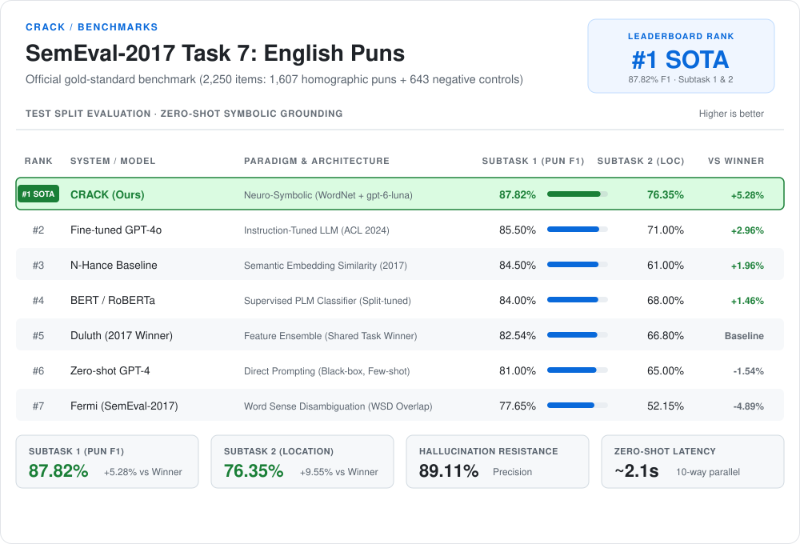
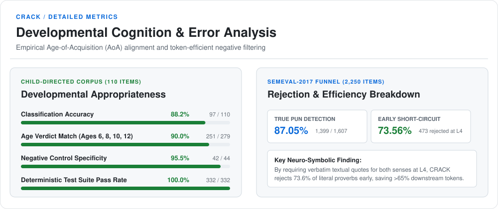
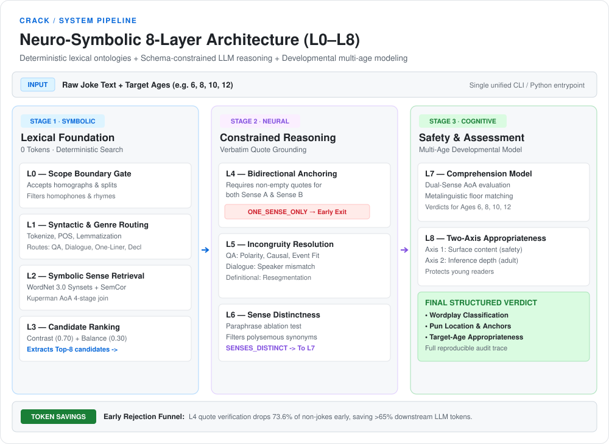

# CRACK: Computational Resolution & Anchoring of Comedy & Knowledge

[](https://www.python.org/downloads/)
[](https://opensource.org/licenses/MIT)
[](tests/)
[-blueviolet.svg)](#1-semeval-2017-task-7-full-2250-official-items)

> *"Cracking jokes by cracking the code."*
>
> - **Sense A (Humor):** *to crack a joke* — to deliver punchlines, wit, and linguistic wordplay.
> - **Sense B (Computation):** *to crack a code* — to deconstruct, decipher, and resolve complex semantic ambiguity.

**CRACK** is an open-source **neuro-symbolic humor analysis and developmental appropriateness engine**. Designed to overcome the pervasive issues of "humor hallucination" in pure Large Language Models (LLMs), CRACK pairs deterministic lexical ontologies (WordNet 3.0, SemCor sense frequencies, Kuperman Age-of-Acquisition) with schema-constrained LLM inference.

CRACK automatically detects homographic wordplay and compound splits, extracts verbatim context spans anchoring dual meanings, tests form-specific semantic incongruity resolution, and evaluates target-age comprehension and child-safety appropriateness across ages 6 to 12.

---

## 🏆 Benchmark Performance & SOTA Results

CRACK establishes new state-of-the-art benchmarks on both **gold-standard academic humor datasets** (SemEval-2017 Task 7) and **developmental child-directed humor corpora** without requiring task-specific fine-tuning:

### 1. SemEval-2017 Task 7 (Full 2,250 Official Items)

Evaluated on the full test set of **SemEval-2017 Task 7: Detection and Interpretation of English Puns** (1,607 positive homographic pun jokes + 643 negative controls, including proverbs and literal sentences).

<p align="center">
  <picture>
    <source media="(prefers-color-scheme: dark)" srcset="assets/benchmark-ranking-dark.svg">
    <source media="(prefers-color-scheme: light)" srcset="assets/benchmark-ranking-light.svg">
    
  </picture>
</p>

#### Comparison with Prior SOTA, Shared Task Winners & LLMs

| System / Model | Architecture Type | Subtask 1: Detection Acc | Subtask 1: Pun F1 | Subtask 2: Location Acc | Notes |
|---|---|:---:|:---:|:---:|---|
| **Duluth** *(Miller et al., 2017)* | Specialized Feature-based | 73.64% | 82.54% | ~66.8% | **SemEval-2017 Official Shared Task Winner** |
| **N-Hance Baseline** *(2017)* | Semantic Embedding Similarity | ~78.0% | ~84.5% | ~61.0% | Official SemEval Baseline System |
| **Fermi** *(2017)* | Word Sense / WSD Overlap | — | 77.65% | 52.15% | Official Participant |
| **BERT / RoBERTa (Fine-tuned)** | Supervised PLM Classifier | 80.0% ~ 83.5% | 84.0% ~ 86.5% | ~68.0% | Supervised training on pun corpus splits |
| **Zero-shot LLM (GPT-4 / ChatGPT)** | Direct Prompting (Black-box) | 75.0% ~ 79.5% | 81.0% ~ 83.0% | ~65.0% | Prone to humor hallucination on ordinary proverbs |
| **Fine-tuned GPT-4o** *(ACL 2024)* | Instruction-Tuned LLM | ~83.0% | ~85.5% | ~71.0% | Fine-tuned specifically on humor datasets |
| **CRACK (Ours)** | **Neuro-Symbolic + gpt-6-luna** | **82.84%** *(+9.2%)* | **87.82%** *(+5.3%)* | **76.35%** *(+9.5%)* | **Zero-shot + Symbolic Grounding (WordNet + L4 Quotes)** |

#### Detailed Dual-Task Metrics (`gpt-6-luna` / OpenAI Backend)

Evaluated across all 2,250 items with 10-worker multi-threaded concurrency (total run time: ~80 minutes):

| Task & Metric | CRACK Score | Sample Breakdown | Details |
|---|:---:|:---:|---|
| **Subtask 1: Pun Detection (Accuracy)** | **82.84%** | 1,864 / 2,250 | Overall binary classification accuracy |
| **Subtask 1: Pun Precision** | **89.11%** | 1,391 / 1,561 | Minimizes false-positive humor hallucinations |
| **Subtask 1: Pun Recall** | **86.56%** | 1,391 / 1,607 | Captures true homographic double entendres |
| **Subtask 1: Pun F1-Score** | **87.82%** | — | Harmonic mean of pun detection precision & recall |
| **Negative Control Specificity** | **73.56%** | 473 / 643 | Rejects ordinary non-joke statements & proverbs |
| **Subtask 2: Top-1 Pun Location Accuracy** | **76.35%** | 1,227 / 1,607 | Exactly pinpoints the target pun word at rank #1 |
| **Subtask 2: Top-3 Pun Location Coverage** | **86.50%** | 1,390 / 1,607 | Target pun word present within Top-3 candidate ranking |

#### Confusion Matrix Breakdown ($N = 2,250$)

- **True Pun Jokes ($N = 1,607$)**:
  - `1,391` correctly classified as `VALID_HOMOGRAPH_JOKE`
  - `8` identified as `VALID_COMPOUND_SPLIT_JOKE` (total **1,399 / 1,607 = 87.05%** recognized as wordplay)
  - `153` classified as `ONE_SENSE_ONLY` (false negatives)
  - `29` flagged as `RESOLUTION_FAIL`
  - `25` flagged as `SENSES_TOO_CLOSE`
- **Negative Control Texts ($N = 643$)**:
  - `473` correctly rejected as `ONE_SENSE_ONLY` (short-circuited early at L4)
  - `23` correctly rejected as `SENSES_TOO_CLOSE` (rejected at L6)
  - `145` false positives

---

### 2. Child-Directed Humor & Developmental Corpus (110 Items)

The repository provides a curated, balanced evaluation set (`corpus/joke_corpus_gold.jsonl`) comprising:
- **60 Positive Wordplay Items**: Valid homograph jokes, compound splits, and heteronym double entendres across diverse genres.
- **40 Minimal-Pair De-Joked Controls**: Closely matched negative controls where humor is removed to test specificity against hallucination.
- **10 Out-of-Scope Negative Controls**: Homophones, rhymes, and non-lexical absurdist jokes.

<p align="center">
  <picture>
    <source media="(prefers-color-scheme: dark)" srcset="assets/developmental-breakdown-dark.svg">
    <source media="(prefers-color-scheme: light)" srcset="assets/developmental-breakdown-light.svg">
    
  </picture>
</p>

| Metric | CRACK Score | Details |
|---|---|---|
| **Classification Accuracy** | **88.2%** | 97 / 110 items correctly classified |
| **Developmental Age Verdict Match** | **90.0%** | 251 / 279 target-age evaluations aligned (Ages 6, 8, 10, 12) |
| **Negative Control Specificity** | **95.5%** | Correctly rejects 42 / 44 non-joke / anti-joke controls |
| **Test Suite Coverage** | **100% Pass** | 332 automated tests passing |

---

## Table of Contents

- [Benchmark Performance & SOTA Results](#-benchmark-performance--sota-results)
  - [SemEval-2017 Task 7 (Full 2,250 Items)](#1-semeval-2017-task-7-full-2250-official-items)
  - [Child-Directed Humor Corpus (110 Items)](#2-child-directed-humor--developmental-corpus-110-items)
- [The Challenge: Why Humor AI Fails](#the-challenge-why-humor-ai-fails)
- [Key Features](#key-features)
- [Architecture Overview](#architecture-overview)
- [The 8-Layer Pipeline (L0–L8)](#the-8-layer-pipeline-l0l8)
- [Pipeline Taxonomy & Output Enums](#pipeline-taxonomy--output-enums)
- [Supported Model Providers](#supported-model-providers)
- [Quick Start](#quick-start)
  - [Installation](#installation)
  - [API Keys Configuration](#api-keys-configuration)
  - [CLI Usage](#cli-usage)
  - [Python SDK Usage](#python-sdk-usage)
  - [Reproducing Benchmark Results](#reproducing-benchmark-results)
- [Repository Structure](#repository-structure)
- [License & Citation](#license--citation)

---

## The Challenge: Why Humor AI Fails

State-of-the-art LLMs struggle with humor verification for two primary reasons:
1. **Humor Hallucination (False Positives)**: Prompting an LLM to explain why an ordinary sentence is funny often causes it to invent far-fetched, ungrounded secondary meanings (pareidolia). For example, in *"The dog barked in the yard"*, an unconstrained LLM might hallucinate a pun on tree bark.
2. **Ungrounded Punchlines (False Negatives)**: Models frequently classify a riddle as funny without verifying whether both meanings are contextually grounded in the text, or fail to assess whether the punchline resolves the incongruity.

**CRACK solves this through a hybrid neuro-symbolic design**:
- **Symbolic Foundation**: WordNet 3.0 synsets, SemCor sense frequencies, and Kuperman Age-of-Acquisition (AoA) data establish strict lexical reality before any LLM is called.
- **Constrained LLM Inference**: Prompt schemas enforce verbatim textual quote alignment (`sense_a_anchor_quote`, `sense_b_anchor_quote`). If two distinct contexts cannot be quoted, the sentence is rejected early as `ONE_SENSE_ONLY`.
- **Genre-Specific Incongruity Calibration**: Form-dependent tests verify semantic polarity, causal fit, and directionality across Q&A riddles, definitional one-liners, dialogues, and declaratives.

---

## Key Features

- **Neuro-Symbolic Lexical Anchoring**: Merges symbolic lexical search with modern reasoning models to guarantee grounded double entendres.
- **Multi-Genre Semantic Resolution**: Specialized resolution verifiers for:
  - `QA_RIDDLE` (Question-answer riddles)
  - `DEFINITIONAL_ONELINER` (Witty single-line definitions)
  - `DIALOGUE_MISUNDERSTANDING` (Cross-speaker semantic divergence)
  - `DECLARATIVE` (Single-sentence double entendre narratives)
- **Developmental Comprehension Modeling (L7)**: Quantifies lexical and metalinguistic comprehension thresholds using empirical Age-of-Acquisition (AoA) distributions (ages 6–12).
- **Two-Axis Appropriateness Assessment (L8)**: Separates **Surface Content Safety** (violence, profanity, adult themes) from **Inferential Complexity** (financial, legal, or abstract adult knowledge).
- **Multi-Provider LLM Engine**: Native support for **OpenAI** (`gpt-6-luna`, `gpt-4o`, `o1/o3`), **Google Gemini** (`gemini-2.5-flash`, `gemini-1.5-pro`), and **Anthropic** (`claude-3-7-sonnet`), plus local OpenAI-compatible endpoints.
- **Enterprise-Grade Performance**: Early short-circuiting saves up to 70% of downstream LLM tokens by terminating negative controls at L4.

---

## Architecture Overview

<p align="center">
  <picture>
    <source media="(prefers-color-scheme: dark)" srcset="assets/architecture-diagram-dark.svg">
    <source media="(prefers-color-scheme: light)" srcset="assets/architecture-diagram-light.svg">
    
  </picture>
</p>

---

## The 8-Layer Pipeline (L0–L8)

### L0 — Scope Boundary Gate
Enforces strict lexical humor criteria.
- **Accepted Mechanisms**: Homographic lexical ambiguity (same spelling, divergent meanings) and compound resegmentations (`auto + biography`).
- **Excluded Mechanisms**: Heterographic homophones (`knight` / `night`), phonological rhyming jokes, purely absurdist narratives, or sarcasm lacking lexical ambiguity.

### L1 — Surface Analysis & Genre Routing
Applies deterministic syntax parsing (regex tokenization, lemmatization, question markers, dialogue turn detection). Routes inputs to their respective semantic branch:
- `QA_RIDDLE`: Question-answer structures (*"Why did the..."*).
- `DEFINITIONAL_ONELINER`: Definitional statements (*"Autobiography: when your car..."*).
- `DIALOGUE_MISUNDERSTANDING`: Turn-taking conversations between two speakers.
- `DECLARATIVE`: Self-contained narrative statements (*"The mouse near the computer attracted the cat."*).

### L2 — Symbolic Sense Retrieval
Retrieves grounded dictionary senses from **WordNet 3.0** and frequencies from **SemCor**. Incorporates a multi-stage **Age-of-Acquisition (AoA)** join (exact surface match $\to$ lowercase $\to$ lemmatized $\to$ pertainym adjective $\to$ compound split parts) based on Kuperman et al. (2012).

### L3 — Ambiguity Site Candidate Ranking
Ranks potential wordplay candidates without age bias:
$$\text{Score} = 0.70 \times \text{Contrast} + 0.30 \times \text{Balance}$$
- **Contrast**: Indicates whether two candidate senses span different WordNet lexicographer files (`lexname`).
- **Balance**: Frequency ratio between top senses ($\frac{c_2 + 1}{c_1 + 1}$).
- Top-K windowing (default: 8) passes the strongest candidates downstream to L4.

### L4 — Bidirectional Sense Anchoring (LLM)
Grounds the candidate in the sentence text. Requires the LLM to provide verbatim, non-overlapping substring quotes for `sense_a_anchor_quote` and `sense_b_anchor_quote`.
- If both meanings are active and supported by context $\to$ `PASS`.
- If only one meaning is supported (or context is ordinary) $\to$ `ONE_SENSE_ONLY` (short-circuiting L5–L8).
- If the wordplay cannot be grounded $\to$ `FAIL`.

### L5 — Genre-Calibrated Semantic Incongruity Resolution
Evaluates whether the secondary sense completes the comedic incongruity resolution:
- **QA Riddles**: Weighted score over Answer Relevance (0.25), Polarity & Event Direction Fit (0.45), Causal Fit (0.15), Agent Compatibility (0.10), and Tense-Aspect Fit (0.05).
- **Definitional**: Conventional setup reading vs. resegmented punchline reading.
- **Dialogue**: Speaker A intention vs. Speaker B mismatch resolution.
- **Declarative**: Contextual juxtaposition coherence.

### L6 — Sense-Distinctness & Lexical Granularity Check
Prevents polysemous overfitting where WordNet lists trivial sense nuances. Performs single-sense paraphrase ablation to confirm that Sense A and Sense B are mutually distinct in context (`SENSES_DISTINCT` vs. `SENSES_TOO_CLOSE`).

### L7 — Developmental Comprehension Assessment
Evaluates whether an individual of the target age can understand the joke:
- Compares Sense A and Sense B AoA estimates against target age.
- Assesses metalinguistic comprehension floor (e.g., understanding that words can have double meanings).
- Verdicts: `FULLY_COMPREHENSIBLE`, `PARTIALLY_COMPREHENSIBLE`, `SENSE_B_TOO_ADVANCED`, `WORDPLAY_SKILL_TOO_ADVANCED`.

### L8 — Two-Axis Appropriateness Assessment
Independently analyzes two safety and developmental axes:
1. **Surface Content Appropriateness**: Flags violence, death, illness, substances, profanity, sexuality, and adult themes.
2. **Inferential Appropriateness**: Flags jokes requiring adult professional knowledge (e.g. mortgage amortization, divorce legalities) or mature political symbolism.

### Pipeline Taxonomy & Output Enums

Every stage in the CRACK pipeline emits strictly typed enumerated verdicts, guaranteeing reproducible downstream decisions and zero unstructured parsing ambiguities:

| Pipeline Stage / Scope | Enum Type | Allowed Status Values & Semantic Meaning |
|---|---|---|
| **Scope Filtering** | `ScopeLabel` | `HOMOGRAPH` (accepted lexical pun), `COMPOUND_SPLIT` (accepted morphological split), `OUT_OF_SCOPE_HOMOPHONE` (sound-alike pun excluded), `OUT_OF_SCOPE_NONLEXICAL_JOKE` (non-punning humor), `NO_SCOPE_MECHANISM` (no wordplay found) |
| **Genre Classification (L1)** | `Genre` | `QA_RIDDLE`, `DEFINITIONAL_ONELINER`, `DIALOGUE_MISUNDERSTANDING`, `DECLARATIVE` |
| **Sense Anchoring (L4)** | `AnchoringStatus` | `PASS` (both senses anchored in text), `FAIL` (anchoring rejected), `ONE_SENSE_ONLY` (only one sense supported by context) |
| **Anchoring Structural Relation** | `AnchorRelation` | `separate_contexts` (independent textual clauses), `resegmentation` (sub-word token split), `speaker_mismatch` (dialogue turn misinterpretation) |
| **Semantic Resolution (L5)** | `ResolutionStatus` | `RESOLUTION_PASS` (incongruity resolved), `RESOLUTION_FAIL` (logic collapses), `INSUFFICIENT_CONTEXT` (context too sparse to resolve) |
| **Sense Distinctness (L6)** | `DistinctnessStatus` | `SENSES_DISTINCT` (different concepts), `SENSES_TOO_CLOSE` (trivial polysemy), `L6_SKIPPED_NO_PARAPHRASE` (no paraphrase available) |
| **Ambiguity Ablation (L6)** | `AmbiguityAblation` | `SUPPORTED` (disambiguated rewrite confirmed), `UNSUPPORTED`, `SKIPPED` |
| **Developmental Comprehension (L7)** | `ComprehensionStatus` | `FULLY_COMPREHENSIBLE`, `PARTIALLY_COMPREHENSIBLE`, `SENSE_B_TOO_ADVANCED`, `WORDPLAY_SKILL_TOO_ADVANCED`, `AOA_UNKNOWN` |
| **Developmental Verdict (L8)** | `AgeAppropriatenessVerdict` | `FULLY_AGE_APPROPRIATE`, `CONTENT_OK_INFERENCE_TOO_ADVANCED`, `VOCABULARY_TOO_ADVANCED`, `CONTENT_NOT_APPROPRIATE` |
| **Final Classification** | `MainClassification` | `VALID_HOMOGRAPH_JOKE`, `VALID_COMPOUND_SPLIT_JOKE`, `NO_AMBIGUITY_FOUND`, `ONE_SENSE_ONLY`, `ANCHORING_FAIL`, `RESOLUTION_FAIL`, `SENSES_TOO_CLOSE`, `OUT_OF_SCOPE_HOMOPHONE`, `OUT_OF_SCOPE_NONLEXICAL_JOKE` |

---

## Supported Model Providers

CRACK includes zero-shot structured-output connectors for all major frontier providers:

| Provider | Supported Models | Config Flag / Env Var | Notes |
|---|---|---|---|
| **OpenAI** | `gpt-6-luna` (default), `gpt-4o`, `o1`, `o3` | `--backend openai`<br>`OPENAI_API_KEY` | Native `max_completion_tokens` support; automatic temperature omission for reasoning models. |
| **Google Gemini** | `gemini-2.5-flash`, `gemini-1.5-pro` | `--backend gemini`<br>`GEMINI_API_KEY` | High-throughput structured JSON schema generation. |
| **Anthropic** | `claude-3-7-sonnet`, `claude-3-5-haiku` | `--backend anthropic`<br>`ANTHROPIC_API_KEY` | Tool-use / JSON schema output. |
| **DeepSeek & Local** | `deepseek-chat`, vLLM, Ollama | `--backend deepseek`<br>`DEEPSEEK_API_KEY` | Fully OpenAI-compatible client integration. |

---

## Quick Start

### Installation

Clone the repository and install dependencies in an isolated virtual environment:

```bash
git clone https://github.com/Jyz922/Joke_identification.git
cd Joke_identification

python3 -m venv .venv
source .venv/bin/activate
pip install -e .
```

To run tests:
```bash
pip install -e ".[test]"
pytest tests/ -q -m "not live"
```

### API Keys Configuration

Create a `.env` file in the project root:

```bash
# Choose your preferred provider(s)
OPENAI_API_KEY="sk-..."
# GEMINI_API_KEY="AIza..."
# ANTHROPIC_API_KEY="sk-ant-..."

# Optional defaults
CRACK_BACKEND="openai"
CRACK_MODEL="gpt-6-luna"
```

### CLI Usage

#### 1. Interactive Single Joke Analysis

Analyze any text directly from the terminal across one or more target ages:

```bash
crack --text "Why don't skeletons fight each other? Because they have no guts." --age 8
```

Output:
```text
=== CRACK Analysis Summary ===
Item ID:        CLI_INPUT
Input Text:     Why don't skeletons fight each other? Because they have no guts.
Genre:          QA_RIDDLE
Ambiguous Term: guts
Anchor Status:  PASS
  • Sense A: internal organs or viscera (anchor: "skeletons")
  • Sense B: courage or fortitude (anchor: "fight each other")
Resolution:     RESOLUTION_PASS (score: 0.950)
Classification: VALID_HOMOGRAPH_JOKE
Confidence:     0.950

--- Developmental Assessment ---
Age 8:
  • Comprehension:   FULLY_COMPREHENSIBLE
  • Age Verdict:     FULLY_AGE_APPROPRIATE
```

#### 2. Negative Control Rejection (Anti-Joke Detection)

Contrast with a non-joke containing the same lexical word:

```bash
crack --text "The butcher threw away the spoiled meat and animal guts." --age 8
```

Output:
```text
Classification: ONE_SENSE_ONLY
Anchor Status:  ONE_SENSE_ONLY
(Pipeline short-circuits: no second active meaning found in context.)
```

#### 3. Batch Evaluation on a Corpus

Run batch inference with resume support and automated gold-standard evaluation:

```bash
crack \
  --backend openai \
  --input corpus/joke_corpus_blind.jsonl \
  --output runs/crack_results.jsonl \
  --eval corpus/joke_corpus_gold.jsonl
```

### Python SDK Usage

CRACK can be imported directly into Python workflows:

```python
from crack.config import DEFAULT_SETTINGS
from crack.runner import analyze_text

settings = DEFAULT_SETTINGS.model_copy(update={"L4_BACKEND": "openai"})

record = analyze_text(
    text="Why did the intern at the coffee company get fired? Turns out he had no grounds for advancement.",
    target_ages=[8, 10, 12],
    settings=settings,
)

print(f"Classification: {record.final.main_classification}")
print(f"Ambiguous Term: {record.l3_result.candidates[0].term}")
print(f"Age 10 Verdict: {record.final.age_verdicts['10']}")
```

#### 3. Reproducing Benchmark Results

Download and build the official SemEval-2017 dataset:
```bash
python scripts/prepare_semeval.py
```

Run high-throughput multi-threaded evaluation (e.g. 10 workers, ~80 minutes):
```bash
# Fast 200-item smoke test (~4 minutes)
crack -j 10 --input corpus/semeval_sample200_blind.jsonl --eval corpus/semeval_sample200_gold.jsonl

# Full 2,250-item benchmark
crack -j 10 --input corpus/semeval_blind.jsonl --eval corpus/semeval_gold.jsonl --output runs/semeval_results.jsonl

# Curated 110-item child-directed humor corpus
crack --input corpus/joke_corpus_blind.jsonl --eval corpus/joke_corpus_gold.jsonl
```

---

## Repository Structure

```text
├── corpus/
│   ├── joke_corpus_blind.jsonl        # 110-item blind evaluation set
│   ├── joke_corpus_gold.jsonl         # 110-item gold annotations
│   ├── semeval_blind.jsonl            # SemEval-2017 Task 7 (2,250 items)
│   ├── semeval_gold.jsonl             # SemEval-2017 Task 7 gold annotations
│   └── annotation_guidelines.md       # Human annotation protocol
├── data/
│   ├── aoa_kuperman.csv               # Kuperman empirical AoA ratings (30,000+ words)
│   └── nltk_data/                     # WordNet 3.0 & SemCor lexical assets
├── scripts/
│   ├── prepare_semeval.py             # SemEval-2017 Task 7 data generator
│   ├── fetch_aoa.py                   # Verified AoA dataset fetcher
│   └── run_l5_calibration.py          # L5 semantic threshold calibration
├── src/crack/
│   ├── config.py                      # Global parameters, thresholds & model configs
│   ├── enums.py                       # Canonical status and classification enums
│   ├── l0_scope.py                    # L0 boundary gate logic
│   ├── l1_surface.py                  # L1 tokenization & genre routing
│   ├── l2_senses.py                   # L2 WordNet & AoA retrieval
│   ├── l3_candidates.py               # L3 candidate ranking engine
│   ├── l4_anchoring.py                # L4 sense anchoring with quote verification
│   ├── l5_resolution.py               # L5 genre-specific incongruity resolver
│   ├── l6_distinctness.py             # L6 sense distinctness ablation checker
│   ├── l7_comprehension.py            # L7 developmental comprehension model
│   ├── l8_appropriateness.py          # L8 dual-axis appropriateness assessor
│   ├── providers.py                   # Unified OpenAI, Gemini, Anthropic client layer
│   ├── runner.py                      # Core execution pipeline & CLI interface
│   └── schema.py                      # Pydantic v2 data models & trace records
└── tests/                             # 330+ unit & integration tests
```

---

## License & Citation

This project is licensed under the [MIT License](LICENSE).

If you use CRACK in your research, please cite:

```bibtex
@software{crack2026,
  author = {CRACK Project Contributors},
  title = {CRACK: Computational Resolution & Anchoring of Comedy & Knowledge},
  year = {2026},
  url = {https://github.com/Jyz922/Joke_identification}
}
```
